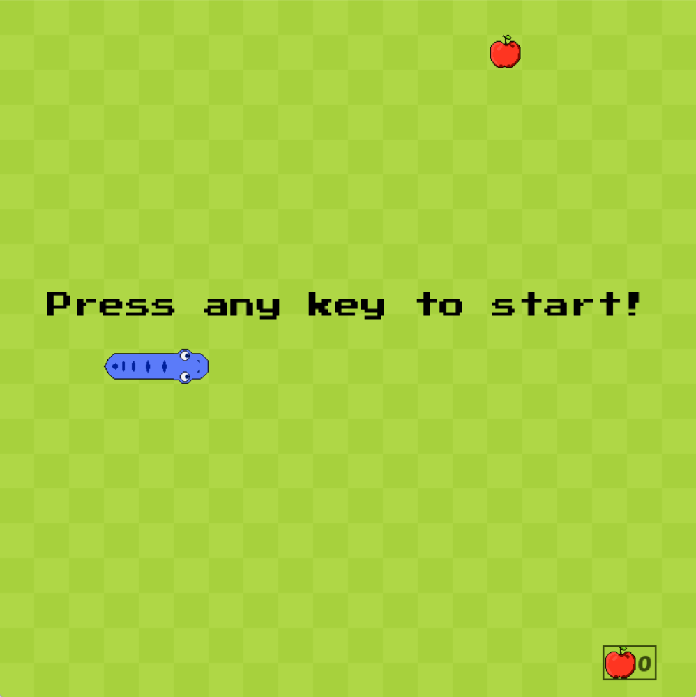
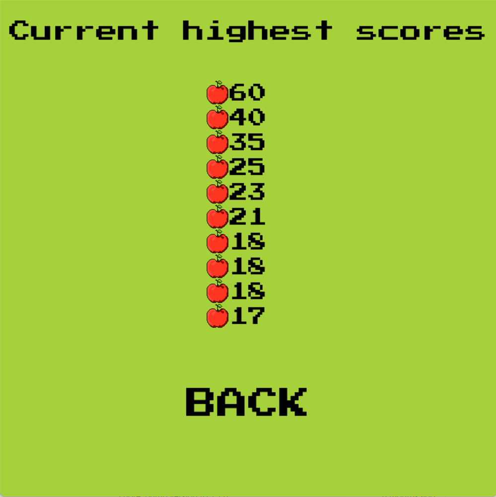

# Snake

A simple snake game made with Pygame. You can control the snake using the arrow keys.

## Features
- classic snake gameplay
- score tracking, with high scores screen
- sound volume control in the options menu






## Requirements
- Python 3.x
- Pygame

## Run

```bash
git clone https://github.com/dawid-walkiewicz/Snake.git
cd Snake
pip install -r requirements.txt
python main.py
```

## Controls
- Arrow keys to move the snake
- Esc to return to the main menu
- Volume slider can be adjusted with the arrow keys